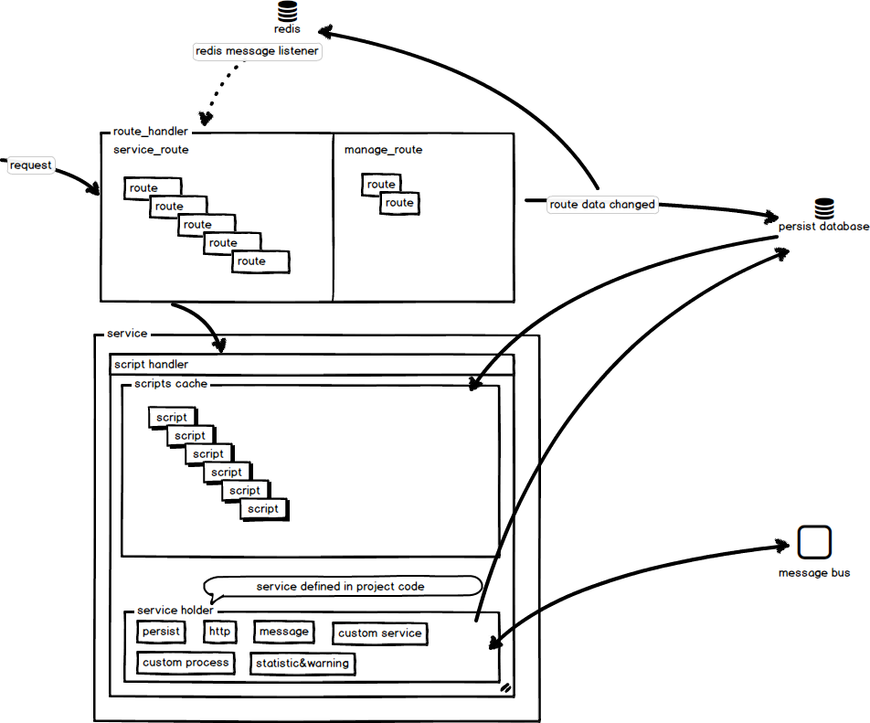
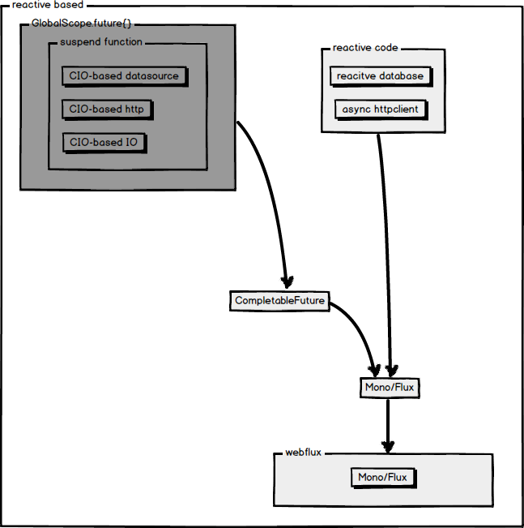
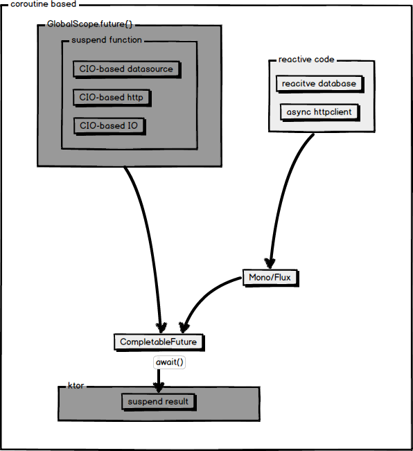

# Script as a Service (SAAS)

build service without rebuild/restart or republish

## Feature

* everything is __async__
* everything is __dynamic__
* every service is __script__
* blocking is not an optional

## Diagram

### dynamic routes & services

### async solutions
* reactive based

* coroutine based

## Asyncript

make groovy support async